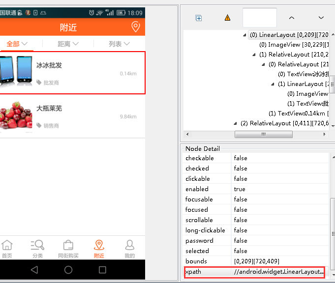

# 自定义uiautomatorviewer xpath功能
* 在使用自动化测试中需要定位元素.一般都是使用sdk下面的uiautomatorviewer,而此工具只能定位id,class,name等，但是没有xpath
* [超级链接](https://android.googlesource.com/platform/frameworks/uiautomator/+/android-sdk-4.4.2_r1.0.1) - `源码下载uiautomatorviewer`
* 需要依赖的文件
	* 对应的android.jar
	* com.google.guava_XXX.jar
	* common.jar
	* ddmlib.jar
	* org.eclipse.core.commands_XXX.jar
	* org.eclipse.equinox.common_XXX.jar
	* org.eclipse.jface_XXX.jar
	* org.eclipse.swt.XXX.jar
	
* org.eclipse.jdt.core.prefs 这里的设置文件要注意下，有时候会报错java的编译版本错误，此坑坑得我太深

* com.android.uiautomator:存放uiautomatorviewer工具的GUI界面代码，其中主入口UiAutomatorViewer.java文件里面有main函数入口，工具的窗口就在此创建。
* com.android.uiautomator.actions：存放所有anction操作，如：Device screenshot 、open等。
* com.android.uiautomator.tree：存放tree封装，dump出来的xml解析成一棵完整的tree，这个包是核心包。

## 代码修改部分
### com.android.uiautomator.tree
#### UiNode.class
```
// 我的新增
    private String getNodeClassAttribute() {
  		return this.mAttributes.get("class");
  	}
	
	  //我的新增
    public String getXpath()
    {
        String className=getNodeClassAttribute();
        String xpath="//"+className;
        String text = getAttribute("text");
        if(text !=null&& !text.equals(""))
        {
            xpath += "[@text='"+text+"']";
            return xpath;
        }else 
        {
            return getAttribute("content-desc") !=""?
                    xpath+"[@content-desc='"+getAttribute("content-desc")+"']"
                    :xpath+"[@index='"+getAttribute("index")+"']";
        }

    }
```

#### UiHierarchyXmlLoader.calss
```
//我的新增
    private UiNode mTmpNode ;
	public BasicTreeNode parseXml(String xmlPath) {
                    //我的修改
                    if (mParentNode != null) {
                        mParentNode.addChild(mWorkingNode);
                        //System.out.println(mNodeList.size());
                        if(mWorkingNode.getParent()!=null){
                        	String xpath = ((UiNode)mWorkingNode).getXpath();
                        	((UiNode)mWorkingNode).addAtrribute("xpath",xpath);
                        }
                        mNodeList.add(mWorkingNode);

                        //System.out.println(mNodeList.size());
                    }
```



